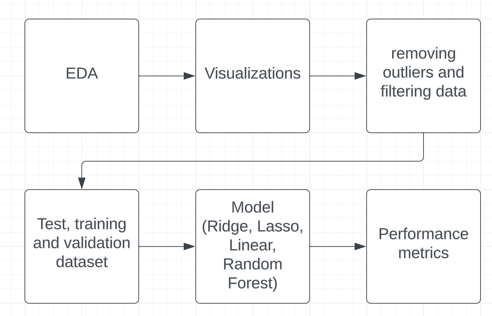
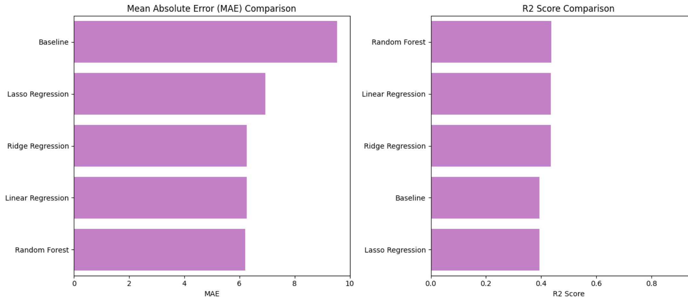

# Predicting someone’s physical health
Nienke van de Kimmenade
Hasty Shakibania
Odongo Ser-Od

# Introduction
Our project involves the construction of three models, developed in-house and built upon a specific dataset. The primary objective of these models is to forecast an independent variable, specifically an individual's physical health, which is a feature within the dataset named "medcenter." Throughout the course of our project, we encountered various challenges related to both the dataset and the code utilized in constructing the models. Addressing these issues necessitated a deeper comprehension of the dataset. Ultimately, we successfully devised three regression models designed to predict an individual's health.

# Methods

 

Firstly, we conducted preprocessing to ensure data quality. Within this preprocessing phase, we took measures to guarantee the distinctiveness of all variables and the absence of missing values. We also analyzed the ranges of certain numerical features, including physical health, BMI, and mental health.  It became apparent that several of our features were categorical, necessitating conversion to numerical format using OneHotEncoder, resulting in binary representations (0 and 1). Additionally, we opted to exclude the patient ID, considering it as non-essential to our model.
After encoding all the categorical variables and removing non-essential variables, we merged our dataset with a new dataframe containing the newly encoded variables, omitting the old variables. This enabled us to perform visualizations between variables and physical health, exploring correlations through techniques such as violin plots, box plots, pie charts, and bar charts. We also employed various statistical measurements to assess the prevalence of specific diseases, like skin cancer, among the population. 
However, during our visualization and analysis, a noteworthy discovery emerged: 70.43% of individuals exhibited a value of 0 in their Physical Health. This raised questions about the underlying reasons for such a significant proportion. Additionally, in the course of our visualizations, we addressed outliers in non-categorical variables such as hours of sleep, BMI, and physical health. Rigorous checks were implemented to ensure the absence of values beyond acceptable thresholds—neither too low nor too high.
In order to start building our models, we needed to split our dataset into a training set and a test set. Our training set consists of 80% of the data and the test set consists of 20%. After this, we took a look at the correlations in our training set to check for multicorrelations.
We then used a standard scaler to transform the features in our training set such that they have a mean of 0 and a standard deviation of 1. This ensures that the features are on a similar scale, preventing some features from dominating others during the modeling process. After implementing the standard scaler we could finally start building the models.
As the nature of our problem involves predicting a continuous numerical variable, regression models were deemed appropriate for this task.
On training models, our group explored and implemented four different regression models to predict a continuous numerical value(physical health 0-30):
-         Linear Regression
-         Ridge Regression
-         Lasso Regression
-         Random forest

We had to conduct extensive visualizations to comprehend our dataset, particularly due to challenges in model training that resulted in poor performance. It became evident that further preprocessing was essential, as our model was overfitting and residual outliers and unnecessary data were still present, influencing our results adversely. We came to the conclusion that this poor model performance was most likely the result of the high amount of zeros in our mental health and physical health variables. Through a combination of statistical analysis and visualizations, we found out that the zeros had two meanings. They were used to represent perfect mental/ physical health, but could also be used as missing values.
We deleted all the zeros of physical health which had no clear indication representing perfect physical health. For example, if someone had skin cancer, we concluded that this would not mean that the physical health of that person would be perfect. For mental health we could not figure out how to establish that someone is in perfect mental health and when the zero would represent a missing value. This led us to deleting all the values of zero in the mental health variable. 
 After removing a part of the data, our models performed a lot better.
 
 
  
# Experimental Design
 
In our analysis, we employed Mean Absolute Error (MAE) and R-squared (R2) score as our evaluation metrics for assessing the performance of our machine learning model. These metrics were chosen for their relevance and effectiveness in capturing different aspects of model performance.
 
To establish a reference point for model performance, we implemented a baseline model. The baseline model is a simple and interpretable model, serving as a benchmark for comparison. The baseline model we used, predicts the mean of the physical health for all instances.
By comparing our proposed model against the baseline model's performance, we aim to demonstrate the effectiveness of our approach in terms of predictive accuracy and model fit. The baseline model's performance is assessed using two key metrics: Mean Absolute Error (MAE) and R2 Score. So we can compare the MEA and R2 score of our other models to this baseline model in order to see if it predicts better than the baseline model.
 
Mean Absolute Error (MAE) serves as a straightforward indicator of prediction accuracy, measuring the average absolute difference between actual and predicted values. Its interpretability and resilience to outliers make MAE particularly valuable in scenarios where a clear and robust measure of accuracy is desired.
 
Similarly, the R-squared (R2) score gauges the model's goodness of fit by assessing the proportion of predictable variance in the dependent variable. Ranging between 0 and 1, a higher R2 score signifies a more effective model in capturing variability. The choice of MAE and R2 is grounded in their ability to provide a comprehensive evaluation of accuracy, offering precise average prediction error and insights into the model's explanatory power. Their interpretability ensures effective communication of results, making them suitable for a broad audience. The robustness of MAE to outliers and R2's indication of explained variance enhance the reliability of our model evaluation across diverse scenarios. In conclusion, the incorporation of MAE and R2 scores in our analysis provides a balanced and insightful perspective on our machine learning model's effectiveness, aligning with study goals and facilitating clear communication in our report.
 
 
# Results

 
 
When evaluating the performance of our models, R2 scores serve as one metric for comparison. Most of our models demonstrate better predictive capabilities compared to our baseline model, with the exception of our Lasso regression model, which yields a lower R2 score. This is also visible in the figure above. Notably, the Random Forest model consistently achieves the highest R2 score, indicating its better performance in explaining variance.
When considering Mean Absolute Error (MAE) scores, the results reinforce the conclusion that the Random Forest model excels in prediction accuracy. It is crucial to note that while the Random Forest model emerges as the best performer based on R2 and MAE scores, this conclusion is contingent on relatively small differences between the other models. The Random Forest model's advantage could be attributed to hyperparameter tuning, a factor that contributes to its slight performance edge over the other three regression models that did not undergo this optimization process. This nuanced understanding underscores the importance of considering not only the final metrics but also the methodologies applied in model development.
In summary, our project findings indicate that, among our models, the Random Forest model exhibits superior predictive accuracy. However, it is important to note that even though the Random Forest model outperforms the others, the overall accuracy achieved falls short of high precision in prediction.

• [Section 5] Conclusions – List some concluding remarks. In particular:
• Summarize in one paragraph the take-away point from your work.
• Include one paragraph to explain what questions may not be fully answered by your work as well as natural next steps for this direction of future work

 # Conclusions

This project has exposed us to a lot of challenges inherent in data analysis and the development of predictive models. Throughout our collaborative efforts, each team member has gained valuable insights, significantly enhancing our understanding of data analysis. The dataset we worked with came with its own challenges, such as the high amount of zeros in the physical health variable, which required considerable time and effort to address.
Despite addressing the issue of the high amount of zeros, our models continue to fall short of achieving the desired level of predictive accuracy. Notably, the Random Forest model emerges as the top performer among our models, notably with a marginal improvement over the others. 

Since our models do not predict with the high accuracy that we hoped for, this is something future work could focus on. We eventually came to the conclusion that we needed to delete all values for mental health since we could not assess which values of zero meant perfect mental health and which were used as missing values. So this is a problem that we could not optimally solve during this project and would hope to solve in the future. Even though our random forest model performed the best in respect to the other models, it has relatively high errors, as indicated by the MSE, RMSE, and MAE. Further analysis and potential model refinement may be necessary to enhance predictive performance. This could involve exploring additional features, adjusting model hyperparameters, or considering alternative algorithms. Additionally, examining the distribution of residuals and potential outliers may provide valuable insights for model improvement. 

