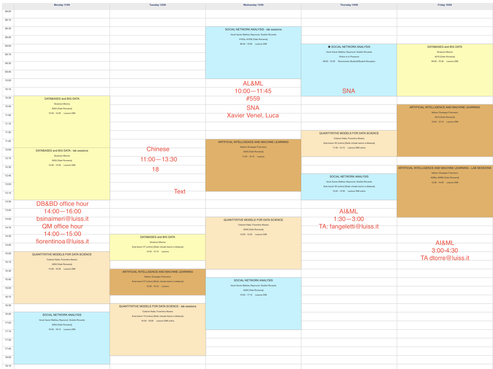

# Predicting someone’s physical health
Nienke van de Kimmenade
Hasty Shakibania
Odongo Ser-Od

# Introduction
Our project involves the construction of three models, developed in-house and built upon a specific dataset. The primary objective of these models is to forecast an independent variable, specifically an individual's physical health, which is a feature within the dataset named "medcenter." Throughout the course of our project, we encountered various challenges related to both the dataset and the code utilized in constructing the models. Addressing these issues necessitated a deeper comprehension of the dataset. Ultimately, we successfully devised three regression models designed to predict an individual's health.

